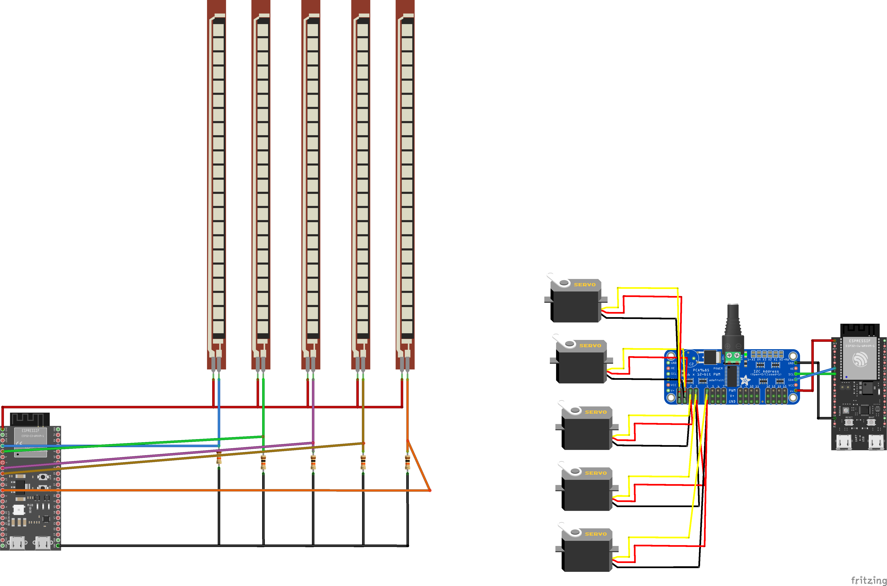

# RoboHand: Wireless Flex-Controlled Robotic Hand

## Overview

RoboHand is a wireless embedded system that translates human finger motion into real-time actuation of a robotic hand. The system uses flex sensors mounted on a glove to capture finger bending, processes those signals on an ESP32-S3, and transmits the resulting angles over Bluetooth Low Energy (BLE) to an ESP32-C6. The C6 then drives multiple servo motors through a PCA9685 PWM controller to replicate the motion on a physical robotic hand.

The goal of this project is to create an intuitive, low-latency human-to-robot interface using embedded systems principles, sensor calibration, and wireless communication.

---

## System Architecture

### 1. Flex Sensor Controller (ESP32-S3)

This subsystem reads and processes user input.

#### Components
- **Flex Sensors**  
  Variable resistors that change resistance when bent. Used to measure finger motion.

- **Analog-to-Digital Conversion (ADC)**  
  Converts flex sensor voltage into digital values.

- **Signal Processing (Software)**  
  - Exponential smoothing to reduce noise  
  - Calibration (`flexMin`, `flexMax`) to map raw values  
  - Optional inversion (`reverseFinger`) for correct direction  

- **BLE Server (NimBLE)**  
  Packages processed angles and transmits them wirelessly.

#### Why it is necessary
This subsystem interprets human motion. Without proper sensing and filtering, the robotic hand would behave inconsistently.

---

### 2. Servo Controller (ESP32-C6)

This subsystem receives commands and actuates the robotic hand.

#### Components
- **BLE Client (NimBLE)**  
  Connects to the S3 and subscribes to angle updates.

- **PCA9685 PWM Driver**  
  Generates stable PWM signals for multiple servos simultaneously.

- **Servo Motors (MG90D)**  
  Convert PWM signals into physical movement.

- **I2C Communication**  
  Connects the C6 to the PCA9685.

#### Why it is necessary
The ESP32 cannot reliably control many servos directly. The PCA9685 ensures precise, jitter-free control across all fingers.

---

## System Behavior

1. User bends fingers → flex sensors change resistance  
2. S3 reads values → smooths and maps to angles  
3. Angles are transmitted over BLE  
4. C6 receives angles → updates target positions  
5. Servos gradually move to match the input  

This results in near real-time mirroring between the human hand and robotic hand.

---

## Problems Encountered

### Servo Range Calibration
Calibrating each servo’s range of motion was challenging. Each finger required:
- Individual min/max calibration
- Direction correction

Without this, motion did not accurately match the user’s hand.

---

### Mechanical Fatigue (Elastic Tendons)
The elastic cords used to return fingers to their resting position wore down over time. This caused:
- Drift in resting position  
- Inconsistent behavior  

---

### 3D Printing Constraints
Due to limited access to 3D printing:
- Tree supports formed inside tendon routing holes  
- These blocked tendon paths  
- Reprinting was not feasible  

---

### Distributed Debugging
Using two microcontrollers introduced complexity:
- Serial debugging required switching between boards  
- BLE issues were harder to isolate  
- I2C failures prevented servo actuation  

---

## Comparison to Real-World Embedded Systems

### Similarities
- Sensor → processing → actuation pipeline  
- Wireless communication (BLE)  
- Multi-controller architecture  
- Real-time responsiveness  

This is similar to:
- Prosthetic hands  
- Teleoperation systems  
- Robotics interfaces  

---

### Differences
- Open-loop system (no feedback from robotic hand)  
- Position-based control instead of force control  
- Less mechanical robustness than industrial systems  

---

## Future Improvements

### Stronger Mechanical Design
- Reinforce structure  
- Use higher torque servos  
- Improve tendon routing  

### Closed-Loop Control
- Add sensors (encoders, force sensors)  
- Enable feedback-based motion  

### Improved Materials
- Replace elastic cords with more durable alternatives  
- Reduce friction in tendon system  

### Custom PCB Integration
- Combine ESP32 + driver into one board  
- Reduce wiring complexity  

### Enhanced Interaction
- Add haptic feedback  
- Implement gesture recognition  

---
## Wiring

  

---

## Conclusion

RoboHand demonstrates a full embedded system pipeline from sensing to wireless communication to actuation. The project highlights the challenges of integrating electrical, mechanical, and software systems. Despite limitations, it successfully achieves intuitive real-time control of a robotic hand and provides a strong foundation for more advanced human-robot interaction systems.
